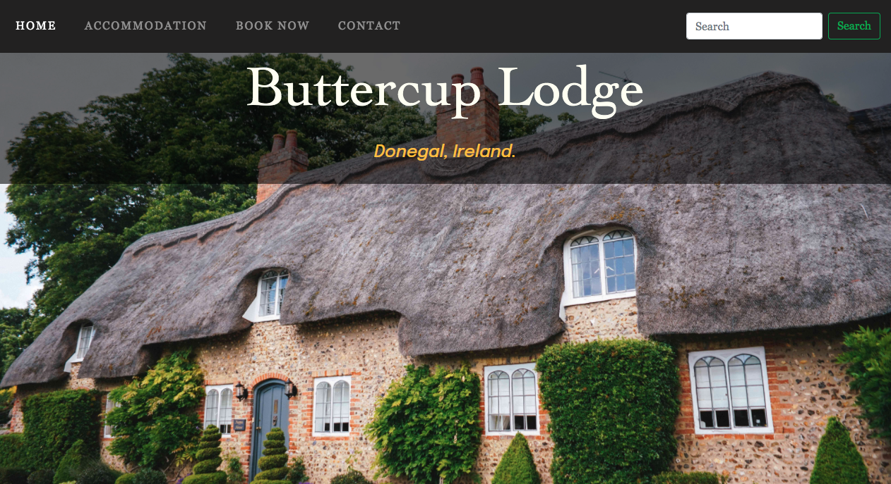
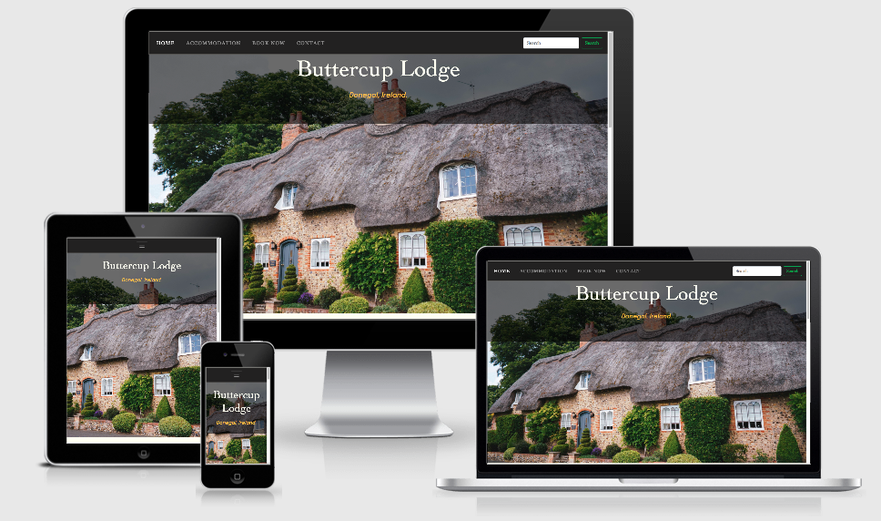
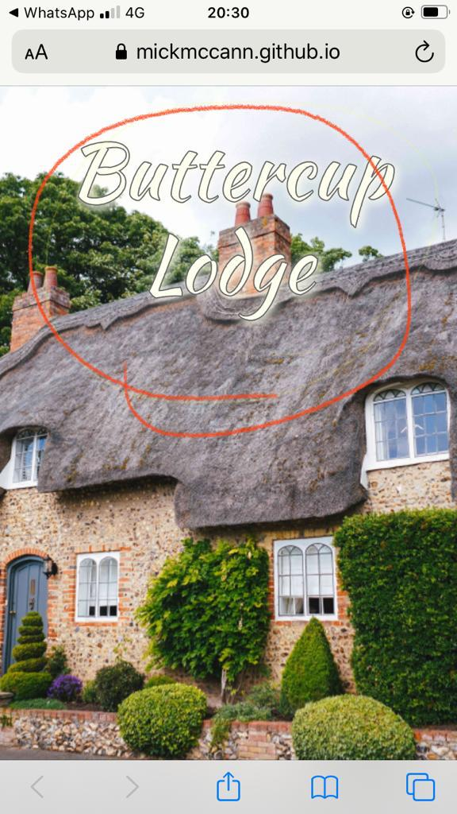

# Buttercup Lodge - by Michael McCann

## A Usercentric Frontend Development Project

Fictitious website and case studies created for education purposes.

<a href="https://mickmccann.github.io/MS1_Buttercup_Lodge/" target="_blank"> Click here to view a live website of the Buttercup Lodge</a>

The aim of this project was to build a responsive static website using HTML5 and CSS3. 

<a href="http://ami.responsivedesign.is/?url=https%3A%2F%2Fmickmccann.github.io%2FMS1_Buttercup_Lodge%2Findex.html" target="_blank">Image generated using Am I Responsive</a>
 
Bed and Breakfast establishment initially called **The Buttercup B 'n' B** approach me with the task of completely updating their website and giving them a brand new logo. Before I started anything, I made the suggestion to the owners if I could change the name as The Buttercup B 'n' B didn't particulary roll off the tongue. They were more than happy with me to go ahead with it and were delighted with the new purposed name of, **Buttercup Lodge**. The word "*lodge*" feels welcoming, cosier and much more inviting than B 'n' B. Luckily, for me they had no business cards printed.

We spoke at length about how I could help them and agreed on the below.

<ol>
    <li>To give them a clean crisp logo.</li>
    <li>To build them an elagant website that will attract new customers and to bring back exsisting customers.</li>
    <li>To help them build on their Google search rankings.</li>
</ol>

I went away and developed a few wireframe sketches based on the clients needs. 
The website will have a **Home**, an **Accomodation**, a **Contact** and a **Book Now** section.

Please note my wireframe designs differ slightly to my finished design

<a href src="assets/wireframes/Buttercup_Lodge_Home.png" target="_blank">Wireframe 1</a>
<a href src="assets/wireframes/Buttercup_Lodge_Accomodation.png" target="_blank">Wireframe 2</a>
<a href src="assets/wireframes/Buttercup_Lodge_Stay_With_Us.png" target="_blank">Wireframe 3</a>
<a href src="assets/wireframes/Tablet_Home_Portrait.png" target="_blank">Wireframe 4</a>
<a href src="assets/wireframes/Tablet_Home_Landscape.png" target="_blank">Wireframe 5</a>

# User Stories

### As a potential customer one expects to see:
<ul>
    <li>Where the Buttercup Lodge is located
    <li>Photographs of rooms
    <li>How much it costs to stay in the Lodge
    <li>A booking form and a contact form
    <li>A calendar to select a date
    <li>To select how many nights I want to stay for
    <li>Phone numbers
    <li>Testimonial quotes from sadisfied customers
    <li>Social networks links
</ul>

### As a returning customer one expects to see:
<ul>
    <li>If there's any change in prices
    <li>If there's any special offers
    <li>If there's any change regarding breakfast
    <li>If there are fully booked out or not
</ul>

# UX Design
It's far easier to generate a good UX experience if you keep your design process simple. 
<ul>
    <li>Users are easily reminded where they are by having an "active" state on the navbar item
    <li>By using a fixed top position on the navbar the menu is always within ease of access and are never "lost". They know where they are and how to get back to where they were
    <li>The design is consistant across all pages, which makes it easy for the user to navigate around the website
    <li>By adding an automatic generated email subject line takes this hassel out of the customer as I've seen people literally take 2 minutes to decicde on an appropriate subject line and just resort to "Hello"
</ul>

Link to the booking form located <a href="https://mickmccann.github.io/MS1_Buttercup_Lodge/booknow.html" target="_blank">here.</a>

# Design Process

I wanted to create a nice, elagant and ease-of-use website that best reflected the subject matter of a bed and breakfast establishment.
The colours I chose were based on the homepage image of the cottage. By using the eyedropper tool in Chrome Dev Tools I was able to select a nice palette.

The background colour is Ivory, a very pale yellow colour. This Ivory is not hard on the eyes as the use of plain white tends to be. I also wanted to get it as close to paper as I could.
A nice charcoal grey for the body text and headings complimented the Ivory colour. The navbar is almost black but again for contrast reasons it's not 100% black.

## Logo Styles
For the logo I decicded on a nice serif typeface
        
        font-family: Cambria, Cochin, Georgia, Times, 'Times New Roman', serif;
        font-size: 3.5rem;
        text-align: center;
        color: ivory;

I felt this complimented the style for what I was trying to achieve than the logo I had initially.

As you can see from the earlier logo, I got bogged down with feature creep! I was using dropshadows and outline on the text. It didn't look great. 

### Body Styles
    color: #666;
    background-color: ivory;
    font-family: "Epilogue", Arial, Helvetica, sans-serif;

### Heading Styles
    color: #666;
    font-family: Georgia, 'Times New Roman', Times, serif;

### Navbar

As per my wireframes the navbar was seated just underneath the hero image, although this looked fine on laptop it was counter intuitive on mobile screens. The user had to scroll up a bit to access menu items.  

### Navbar Hover

Initially I just had a regular hover effect where by the colour just snaps off and then I was reminded of the nice effects on <a href="https://ianlunn.github.io/Hover/" target="_blank">Hover.css.</a>
So for the effect on my navbar, I used "Underline Reveal". 

# Technologies Used
## Languages Used
HTML5
CSS3

## Frameworks, Libraries & Programs Used
Bootstrap 4.5.0:
Bootstrap was used to assist with the responsiveness and styling of the website.
Hover.css:
Hover.css was used on the navbar items and for social media icons in the footer 
Google Fonts:
Google fonts were used to import the 'Epilogue' (main body font) and 'Kaushan Script' (font used for logo at the initial design stage).
Font Awesome:
Font Awesome was used for footer social network links.
GitPod
Git was used for version control by utilizing the Gitpod terminal to commit to Git and Push to GitHub.
GitHub:
GitHub is used to store the projects code after being pushed from Git.
Balsamiq:
Balsamiq was used to create the wireframes during the design process.
Lorem Ipsum:
Used https://loremipsum.io/generator/ to generate dummy text.

Read https://developer.mozilla.org/en-US/docs/Learn/CSS/Building_blocks/Organizing to find out best practices for code struture.

Used https://compressjpeg.com/ to compress images

Used https://picresize.com/en/results to resize images

Intro text adapted from https://www.clontarfcastle.ie/

Used https://www.campaignmonitor.com/resources/knowledge-base/how-do-you-add-a-subject-to-a-mailto/ to find out how to generate an automatic subject line.