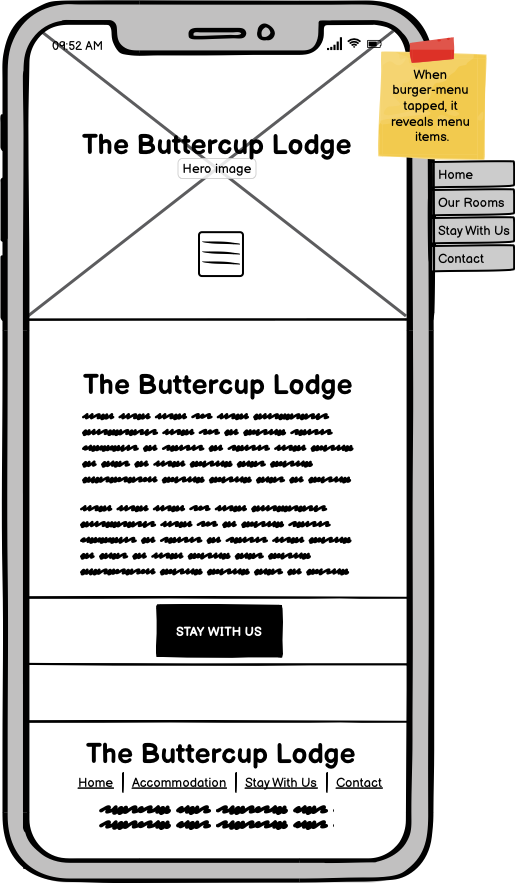
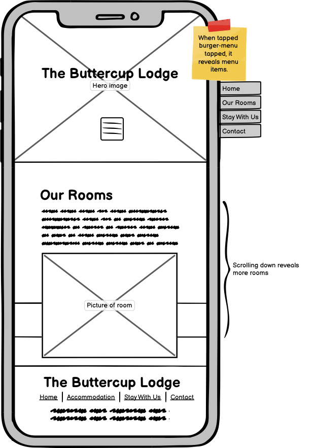
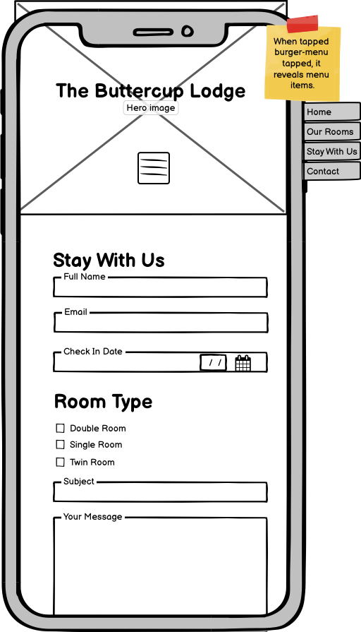
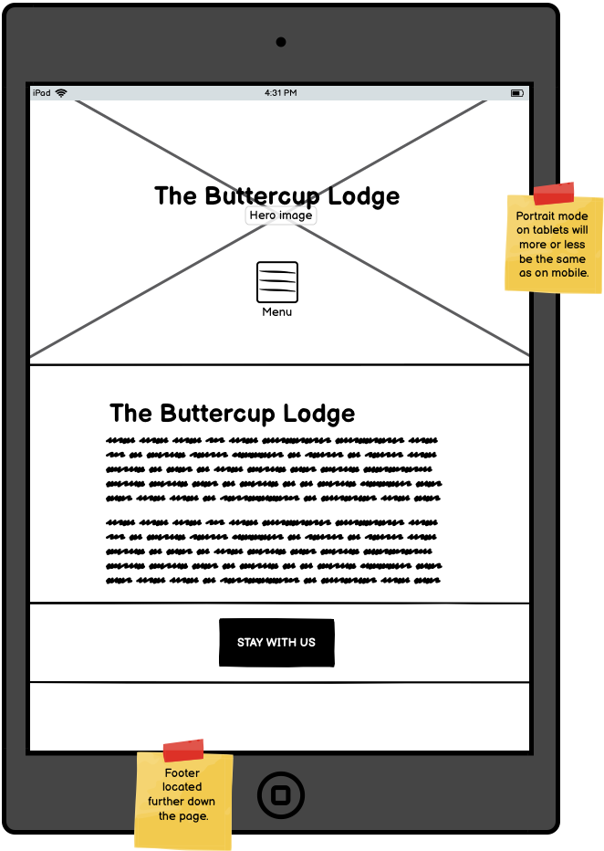
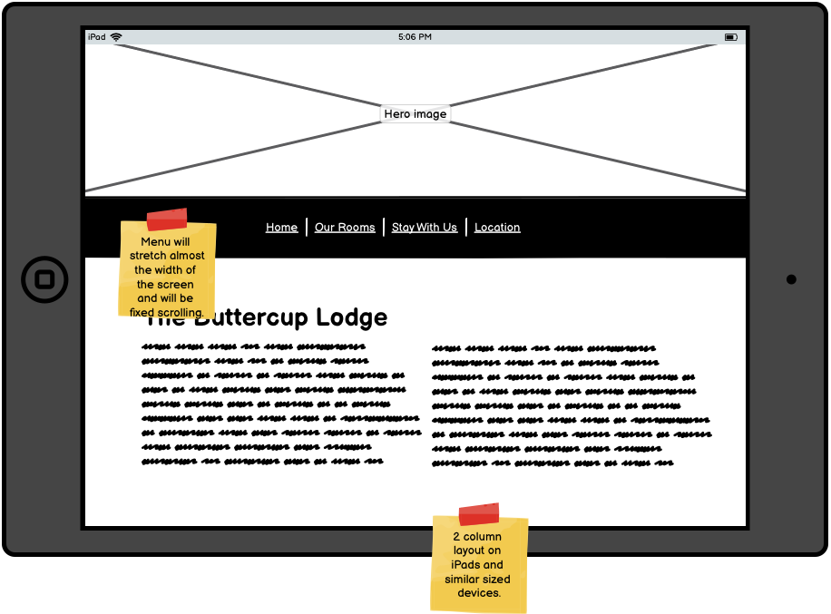

# Buttercup Lodge - by Michael McCann

## A Usercentric Frontend Development Project

Fictitious website and case studies created for education purposes.

<a href="https://mickmccann.github.io/MS1_Buttercup_Lodge/" target="_blank"> Click here to view a live website of the Buttercup Lodge</a>

The aim of this project was to build a static website using HTML5 and CSS3. 

Bed and Breakfast establishment initially called **The Buttercup B 'n' B** approach me with the task of completely updating their website and giving them a brand new logo. Before I started anything, I made the suggestion to the owners if I could change the name as The Buttercup B 'n' B didn't particulary roll off the tongue. They were more than happy with me to go ahead with it and were delighted with the new purposed name of, **Buttercup Lodge**. The word "*lodge*" feels welcoming, cosier and much more inviting than B 'n' B. Luckily, for me they had no business cards printed.

We spoke at length about how I could help them and agreed on the below.

<ol>
    <li>To give them a clean crisp logo.</li>
    <li>To build them an elagant website that will attract new customers and to bring back exsisting customers.</li>
    <li>To help them build on their Google search rankings.</li>
</ol>

I went away and developed a few wireframe sketches based on the clients needs. 
The website will have a **Home**, an **Accomodation**, a **Contact** and a **Book Now** section.

# User Stories

As a potential customer one expects to see:
<ul>
    <li>Where the Buttercup Lodge is located
    <li>Photographs of rooms
    <li>How much it costs to stay in the Lodge
    <li>A booking form and a contact form
    <li>A calendar to select a date
    <li>To select how many nights I want to stay for
    <li>Phone numbers
    <li>Testimonial quotes from sadisfied customers
    <li>Social networks links
</ul>

Link to the booking form located <a href="https://mickmccann.github.io/MS1_Buttercup_Lodge/booknow.html" target="_blank">here.</a>

# Design Process

I wanted to create a nice, elagant and ease-of-use website that best reflected the subject matter of a bed and breakfast establishment.
The colours I chose were based on the homepage image of the cottage. By using the eyedropper tool in Chrome Dev Tools I was able to select a nice palette.

The body colour is Ivory, a very pale yellow colour. This Ivory is not hard on the eyes as the use of plain white tends to be. I also wanted to get it as close to paper as I could.
A nice charcoal grey for the body text and headings complimented the Ivory colour. The navbar is almost black but again for contrast reasons it's not 100% black.

### Body Styles
    color: #666;
    background-color: ivory;
    font-family: "Epilogue", Arial, Helvetica, sans-serif;

### Heading Styles
    color: #666;
    font-family: Georgia, 'Times New Roman', Times, serif;

### Navbar Hover
    Initially I just had a regular hover effect where by the colour just snaps off and then I was reminded of the nice effects on <a href="https://ianlunn.github.io/Hover/" target="_blank">Hover.css.</a>
    So for the effect on my navbar, I used "Underline Reveal". 

# UX Design
It's far easier to generate a good UX experience if you keep your design process simple. 
<ul>
    <li>Users are easily reminded where they are by having an "active" state on the navbar item
</ul>

Used https://loremipsum.io/generator/ to generate dummy text.

Read https://developer.mozilla.org/en-US/docs/Learn/CSS/Building_blocks/Organizing to find out best practices for code struture.

Used hover.css

Used https://css-tricks.com/adding-stroke-to-web-text/ to give logo an outline

Used https://compressjpeg.com/ to compress images

Used https://picresize.com/en/results to resize images

Intro text adapted from https://www.clontarfcastle.ie/

Used https://www.campaignmonitor.com/resources/knowledge-base/how-do-you-add-a-subject-to-a-mailto/ to find out how to generate an automatic subject line.