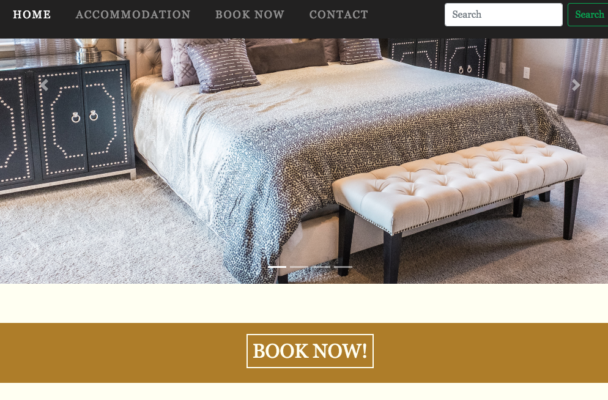
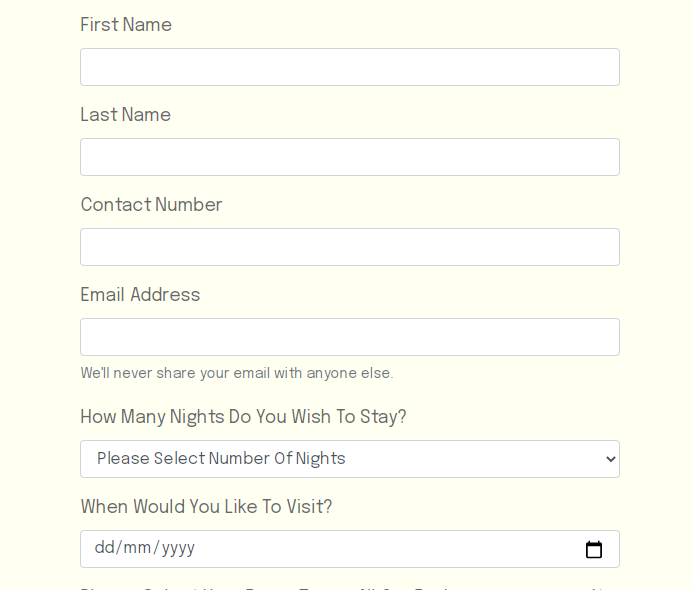
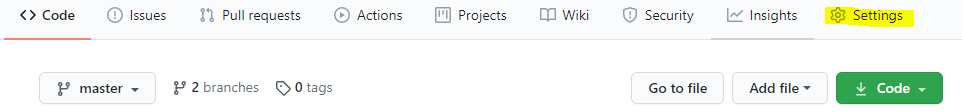
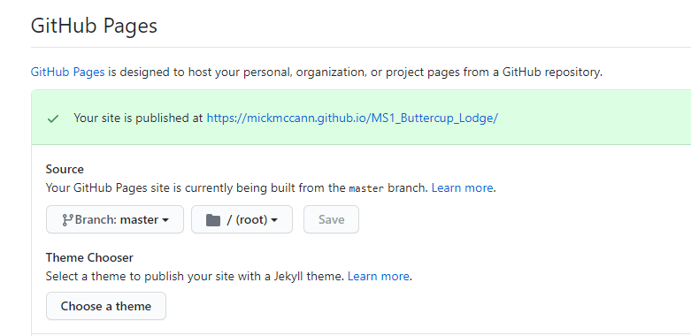
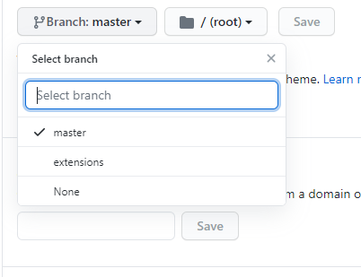
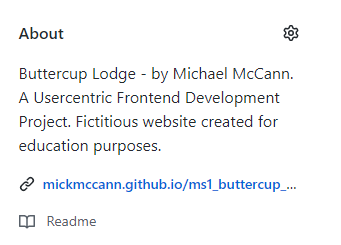

# Buttercup Lodge - by Michael McCann

## A Usercentric Frontend Development Project

Fictitious website created for education purposes.

<a href="https://mickmccann.github.io/MS1_Buttercup_Lodge/" target="_blank"> Click here to view a live website of the Buttercup Lodge</a>

The aim of this project was to build a responsive static website using HTML5 and CSS3. 

<a href="http://ami.responsivedesign.is/?url=https%3A%2F%2Fmickmccann.github.io%2FMS1_Buttercup_Lodge%2Findex.html" target="_blank">Image generated using Am I Responsive</a>

## Scope - A role play one might have with the customers
Bed and Breakfast establishment initially called **The Buttercup B 'n' B** approach me with the task of completely updating their website and giving them a brand new logo. Before I started anything, I made the suggestion to the owners if I could change the name as The Buttercup B 'n' B didn't particulary roll off the tongue. They were more than happy with me to go ahead with it and were delighted with the new purposed name of, **Buttercup Lodge**. The word "*lodge*" feels welcoming, cosier and much more inviting than B 'n' B. Luckily, for me they had no business cards printed.

We spoke at length about how I could help them and agreed on the below.

<ol>
    <li>To give them a clean crisp logo.</li>
    <li>To build them an elagant website that will attract new customers and to bring back exsisting customers.</li>
    <li>To help them build on their Google search rankings.</li>
    <li>To implement an ease-of-use booking form.</li>
</ol>

## Skeleton

I went away and developed a few wireframe sketches based on the clients needs. 
The website will have a **Home**, an **Accomodation**, a **Contact** and a **Book Now** section.

The menu will be centred at the top of the pages below will sit a visual striking image. Each page will have its own dedicated hero image. The Home page will have an exterior image of the Lodge, the Accomodation page an image of a bedroom, the contact page will have an image of the location and finally Book Now will have an interior image to entice the website vistor to stay. Hopefully all imagery evokes the visitor to want to stay!

<strong>Please note the wireframe designs differ slightly to my finished design.</strong>

[Wireframe 1](https://github.com/mickmccann/MS1_Buttercup_Lodge/blob/master/assets/wireframes/buttercup_lodge_home.png)

[Wireframe 2](https://github.com/mickmccann/MS1_Buttercup_Lodge/blob/master/assets/wireframes/buttercup_lodge_accomodation.png)

[Wireframe 3](https://github.com/mickmccann/MS1_Buttercup_Lodge/blob/master/assets/wireframes/buttercup_lodge_stay_with_us.png)

[Wireframe 4](https://github.com/mickmccann/MS1_Buttercup_Lodge/blob/master/assets/wireframes/tablet_home_portrait.png)

[Wireframe 5](https://github.com/mickmccann/MS1_Buttercup_Lodge/blob/master/assets/wireframes/tablet_home_landscape.png)

# User Stories

### Potential Customer: 

As a user, I expect to see -
<ul>
    <li>Where the Buttercup Lodge is located.
    <li>Photographs of rooms.
    <li>How much it costs to stay in the Lodge.
    <li>A booking form and a contact form.
    <li>A calendar to select a date.
    <li>To select how many nights I want to stay for.
    <li>Phone numbers.
    <li>Testimonial quotes from sadisfied customers.
    <li>Social networks links.
</ul>

### Returning Customer: 

As a user, I expect to see -
<ul>
    <li>If there's any change in prices.
    <li>If there's any special offers.
    <li>If there's any change regarding breakfast cost.
    <li>If they are fully booked out or not.
    <li>The layout and content is the same.
    <li>Things are where they are when I last visited. So I can easily find the information I'm looking for.
    <li>If contact information is the same.
</ul>

# UX Design
It's far easier to generate a good UX experience if you keep your design process simple. 
<ul>
    <li>Users are easily reminded where they are by having an "active" state on the navbar item.
    <li>By using a fixed top position on the navbar the menu is always within ease of access and are never "lost". They know where they are and how to get back to where they were.
    <li>The design is consistant across all pages, which makes it easy for the user to navigate around the website.
    <li>By adding an automatic generated email subject line takes the hassel out of the customer as I've seen people literally take 2 minutes to decicde on an appropriate subject line and just resort to "Hello".
</ul>

Link to the booking form located <a href="https://mickmccann.github.io/MS1_Buttercup_Lodge/booknow.html" target="_blank">here.</a>

# Structure - Design Process

I wanted to create a nice, elagant and ease-of-use website that best reflected the subject matter of a bed and breakfast establishment.
The colours I chose were based on the homepage image of the cottage. By using the eyedropper tool in Chrome Dev Tools I was able to select a nice palette.

The background colour is Ivory, a very pale yellow colour. This Ivory is not hard on the eyes as the use of plain white tends to be. I also wanted to get it as close to paper as I could. 
A nice charcoal grey for the body text and headings complimented the Ivory colour. The navbar is almost black but again for contrast reasons it's not 100% black.

## Logo Styles
For the logo I decicded on a nice serif typeface
        
        font-family: Cambria, Cochin, Georgia, Times, 'Times New Roman', serif;
        font-size: 3.5rem;
        text-align: center;
        color: ivory;

I felt this complimented the style for what I was trying to achieve than the logo I had initially.

As you can see from the earlier logo, I got bogged down with feature creep! I was using dropshadows and outline on the text. It didn't look great.  

### Body Styles
    color: #666;
    background-color: ivory;
    font-family: "Epilogue", Arial, Helvetica, sans-serif;

### Heading Styles
    color: #666;
    font-family: Georgia, 'Times New Roman', Times, serif;

### Navbar

As per my wireframes the navbar was seated just underneath the hero image, although this looked fine on laptop it was counter intuitive on mobile screens. The user had to scroll up a bit to access menu items.  

### Navbar Hover

Initially I just had a regular hover effect where by the colour just snaps off and then I was reminded of the nice effects on <a href="https://ianlunn.github.io/Hover/" target="_blank">Hover.css.</a>
So for the effect on my navbar, I used "Underline Reveal". 

# Features

The website is responsive across all platforms. A collapseable menu with a search bar adds to this feature.

Striking visual imagery creates "welcoming" feeling with the user as they navigate throughout the site.

The Accomodation Page has a list of features that all of the rooms has. An implemented Bootstrap Carousel with imagery of all the bedrooms makes it easier for visitors to see what's on offer at a glance.

A large "BOOK NOW" button entices the visitor to click after seeing the image of the breakfast and then of the beedrooms.

The BOOK NOW and CONTACT pages have forms with all of the necessary fields you'd expect on a form.

To give the site a personal touch, I added an automatic generated email subject line as well as a favicon. The Phone number in the footer, when tapped or clicked opens up WhatsApp.

## Features I'd like to add if I had the time or skillset
1. An interactive map.
2. Instead of a hero image it would be very nice if I had a video as a background.
3. An instant messanger.
4. A feature so users can sign up to special offers.

# Languages Used

<ul>
    <li>HTML5
    <li>CSS3
</ul>

# Testing Phase
## First Time Visitor Goals

Whether the website was sent to the user, found through a search result,the user wants to easily understand the main purpose of the site.

When entering the website, the user is greeted with a large image of the lodge. With a clean and easily navigational menu that's fixed to the top of the screen makes the user feel reasurred that they are never lost. An "Active" state on the menu reminds the user what page they are on.

The main points are made immediately on the front page as to the sites purpose and what is offered.

The user can view more details by clicking through to the various pages and subsequently the BOOK NOW page should they wish to stay.

The user wants to be able to easily be able to navigate throughout the site to find content.

The BOOK NOW / CONTACT page allows the user to use a form to make a booking or to contact the Lodge. Users aren't permitted to submit the form unless all required fields are filled.

The footer page has contact details, menu links and social network links.

More information can be found on the Accommodation page with inviting imagery of bedrooms and breakfast.

<table>
<tr>
    <th>TEST</th>
    <th>EXPECTED OUTCOME</th>
    <th>PASS / FAIL</th>
  </tr>
  <tr>
    <td>Menu / Burger Menu</td>
    <td>When tapped menu items are revealed. When tapped again menu items disappear.</td>
    <td>Passed</td>
  </tr>
  <tr>
    <td>Social Network</td>
    <td>When clicked or tapped on, social network pages open in a new page.</td>
    <td>Passed</td>
  </tr>
  <tr>
    <td>WhatsApp</td>
    <td>When tapped on in mobile WhatsApp opens.</td>
    <td>Passed</td>
  </tr>
  <tr>
    <td>Forms</td>
    <td>To build an ease-of-us booking and contact form. If a users tries to submit a form without filling out a required field, they are reminded by a notification on-screen</td>
    <td>Passed</td>
  </tr>
  <tr>
    <td>Responsiveness</td>
    <td>To test whether or not website is responsive across all platforms. For example: On tablet, when viewed in landscape, menu is in full view. When viewed in portrait mode, menu collapses to a button.</td>
    <td>Passed</td>
  </tr>
  <tr>
    <td>Imagery</td>
    <td>To make sure images respond whether view on mobile, tablet or larger screens</td>
    <td>Passed</td>
  </tr>
</table>

The website was tested across multiple browsers (Chrome, Safari, Edge, FireFox) and on multiple mobile devices (iPhone 5, 6, 11: Chrome and Safari, iPad, Samsung Galaxy) to ensure compatibility and responsiveness.  
Initially I found it a bit of a struggle trying to get the website to display exactly how it was intended across all devices. But in the end, I did achieve the desired results.

Google Web Developer (right click and select Inspect) was used throughout the build from the very beginning. It was used to test responsiveness, to address issues relating to alignment, flow and to debug.

The W3C Markup Validator and W3C CSS Validator Services were used to validate every page of the project to ensure there were no errors in the project. There are however a couple of warnings.

My initial wireframes had a 2 col display on tablet and laptop, however I thought I was taking too long to get it to display how I wanted and as a result I resorted to having everything centred align. In future, for my MS2 I will be reading Bootstrap Documentation more thoroughly!

# Frameworks, Libraries & Programs Used
<a href="https://getbootstrap.com/" target="_blank"><strong>Bootstrap</strong></a> 
Bootstrap was used to assist with the responsiveness (i.e. On mobile devices menu collapses down to a square button) and styling of the website.

<a href="https://ianlunn.github.io/Hover/" target="_blank"><strong>Hover.css</strong></a> 
Hover.css was used on the navbar items and for social media icons in the footer.

<a href="https://fonts.google.com/" target="_blank"><strong>Google Fonts</strong></a> 
Google fonts were used to import the 'Epilogue' (main body font) and 'Kaushan Script' (font used for logo at the initial design stage).

<a href="https://fontawesome.com/" target="_blank"><strong>Font Awesome</strong></a> 
Font Awesome was used for footer social network links.

<a href="https://gitpod.io" target="_blank"><strong>GitPod</strong></a> 
Development environment used to build the project. 
Git was used for version control. 

<a href="https://github.com" target="_blank"><strong>GitHub</strong></a> 
GitHub is used to store the projects code after being saved from GitPod and then Pushed from the terminal using Git commands.

<a href="https://balsamiq.com/wireframes/desktop/" target="_blank"><strong>Balsamiq</strong></a> 
Balsamiq was used to create the wireframes.

<a href="https://loremipsum.io/generator/" target="_blank"><strong>Lorem Ipsum</strong></a> 
During the building stage Lorem Ipsum was used to generate dummy text.

Used <a href="https://compressjpeg.com/">compressjpeg.com</a> to compress images and used <a href="https://picresize.com/en/results">picresize.com</a> to resize images.

# Inspiration and Documentation

### Sources of Inspiration

I found these sites in particular to be very influential in terms of building an elegant site. 
<a href="https://www.abbeytavern.ie/" target="_blank">Abbey Tavern</a> 
<a href="https://www.clontarfcastle.ie/" target="_blank">Clontarf Castle</a> 
<a href="https://www.awwwards.com/" target="_blank">Awwwards</a> 
<a href="https://www.lucknampark.co.uk/" target="_blank">Lucknam Park</a>

### Documentation
In order to to find out best practices for code struture I found this article quite useful. https://developer.mozilla.org/en-US/docs/Learn/CSS/Building_blocks/Organizing 
 

I wanted to do something a bit different with a mailto link to generate a good UX so I figured out how to generate an automatic subject line by reading this. Turns out it's not hard at all! https://www.campaignmonitor.com/resources/knowledge-base/how-do-you-add-a-subject-to-a-mailto/ 
 

Read Bootstraps Documentation on grid, form and menu best practices https://getbootstrap.com/docs/4.5/getting-started/introduction/

# Deployment
This site is hosted using GitHub pages, deployed directly from the master branch. The deployed site will update automatically upon new commits to the master branch. In order for the site to deploy correctly on GitHub pages, the landing page must be named index.html.

To run locally, you can clone this repository directly into the editor of your choice by pasting git clone https://github.com/mickmccann/MS1_Buttercup_Lodge.git into your terminal. To cut ties with this GitHub repository, type git remote rm origin into the terminal.

## GitHub Pages

To make the website live using GitHub Pages, I followed these steps:

1. I clicked on the settings icon.

2. Scrolled down to the GitHub Pages section.

3. I then clicked on the Branch tab, selected Master and then Save.

4. I copied the generated link and pasted it into the About section.

# Credits
Content on the <a href="https://mickmccann.github.io/MS1_Buttercup_Lodge/index.html" target="_blank">Homepage</a> and <a href="https://mickmccann.github.io/MS1_Buttercup_Lodge/index.html" target="_blank">Accomodation</a> were adapted from the <a href="https://www.clontarfcastle.ie/" target="_blank">Clontarf Castle</a>.

# Media
<a href="https://unsplash.com/" target="_blank">Unsplash.</a>  Unsplash was used to source all imagery for the website.

# Acknowledgements
Thanks to my mentor Brian Macharia for his guidence and feedback and to Neringa on Slack.